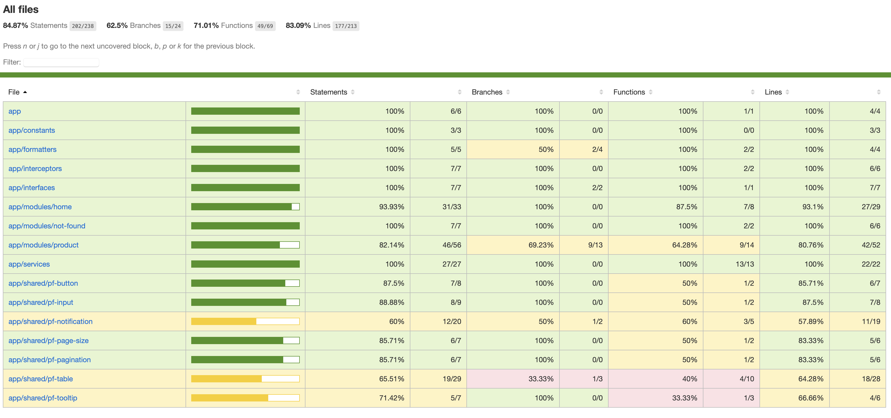

# BankingProducts

This project was generated with [Angular CLI](https://github.com/angular/angular-cli) version 17.3.3.

Please run `npm i` to download node dependencies.

## Development server

Run `ng serve` for a dev server. Navigate to `http://localhost:4200/`. The application will automatically reload if you change any of the source files.

## Running unit tests

Run `npm test` to execute the unit tests via [Jest](https://jestjs.io) to see the coverage.
  1. Go to the coverage folder in the projec after executed `npm test`.
  2. Open the folder coverage.
  3. Open file `index.html`.

# Test Coverage

There is a `.env.example` file in the root directory, please rename this file as `.env` and modify the following keys:
  1. API_URL with the given URL
  2. AUTHOR_ID with the given number.
